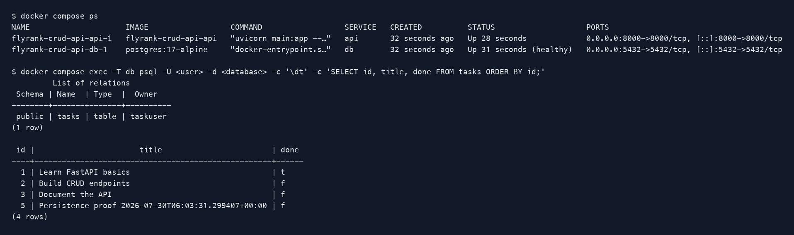

# FlyRank Task CRUD API — Docker + Postgres

A containerized REST API built with **Python**, **FastAPI**, **PostgreSQL**, and **Docker Compose** for FlyRank BE-04. The API and database start together with one command, and a named Docker volume keeps task data after both containers restart.

This repository preserves the storage progression from the earlier assignments:

```text
BE-01: FastAPI routes → in-memory list
BE-02: FastAPI routes → SQLite file
BE-04: FastAPI routes → Postgres repository → Postgres container + volume
```

## Architecture proof

The public API contract did not change. The same route handlers in `main.py` still call the same repository functions:

- `fetch_all_tasks()`
- `fetch_task()`
- `insert_task()`
- `update_task_record()`
- `delete_task_record()`

For BE-04, the SQL implementation inside `database.py` changed from SQLite to Postgres, and Docker infrastructure files were added. The route behavior and request/response shapes stayed the same. Only the FastAPI description text was updated so Swagger identifies the current Postgres storage engine.

```text
Client → FastAPI routes → database.py repository → Postgres service → taskdata volume
```

## Requirements

- Docker Desktop with Docker Compose
- Git
- Optional for local verification scripts: Python 3.10+ and the existing `.venv`

No local Postgres installation is required.

## One-command stack

Create the local environment file once:

```bash
cp .env.example .env
```

Then start the API and Postgres together:

```bash
docker compose up
```

Use `-d` to run in the background:

```bash
docker compose up -d
```

The API is available at:

- API: <http://localhost:8000>
- Swagger UI: <http://localhost:8000/docs>

Stop both containers while keeping the database volume:

```bash
docker compose down
```

`docker compose down -v` also deletes the volume and should only be used when a complete database reset is intended.

## Environment variables

`.env` is ignored by Git. `.env.example` documents the required local variables:

| Variable | Purpose |
|---|---|
| `POSTGRES_USER` | Local Postgres user |
| `POSTGRES_PASSWORD` | Local development password |
| `POSTGRES_DB` | Database name |
| `API_PORT` | Host port for FastAPI |
| `DATABASE_URL` | Connection string used by the repository |

Inside the Compose network, the API connects to the hostname `db`, which is the Postgres service name. It does not use `localhost` from inside the API container.

## Automatic database setup

At startup, `database.py`:

1. reads `DATABASE_URL` from the environment;
2. waits for Postgres to accept connections;
3. executes [`sql/postgres_schema.sql`](sql/postgres_schema.sql);
4. inserts the three example tasks only when the table is empty.

Schema:

```sql
CREATE TABLE IF NOT EXISTS tasks (
    id SERIAL PRIMARY KEY,
    title TEXT NOT NULL,
    done BOOLEAN NOT NULL DEFAULT FALSE
);
```

All user-controlled values are passed separately through psycopg `%s` placeholders. They are never concatenated into SQL strings.

## Endpoints

| Method | Endpoint | Purpose | Success status |
|---|---|---|---:|
| GET | `/` | API information | 200 |
| GET | `/health` | API health | 200 |
| GET | `/tasks` | List all Postgres tasks | 200 |
| GET | `/tasks/{task_id}` | Get one task | 200 |
| POST | `/tasks` | Create a task | 201 |
| PUT | `/tasks/{task_id}` | Update title and/or completion | 200 |
| DELETE | `/tasks/{task_id}` | Delete a task | 204 |
| GET | `/docs` | Swagger UI | 200 |

Unknown task IDs return status `404`:

```json
{"error":"Task not found"}
```

Invalid POST and PUT bodies return status `400` with a JSON error message.

## Example curl request

```bash
curl -i -X POST http://localhost:8000/tasks \
  -H "Content-Type: application/json" \
  -d '{"title":"Persist this Postgres task"}'
```

Example response:

```text
HTTP/1.1 201 Created
content-type: application/json

{"id":4,"title":"Persist this Postgres task","done":false}
```

## Full verification and persistence proof

With Docker Desktop running, use:

```bash
./scripts/verify_stack.sh
```

That script:

1. starts and builds the full Compose stack;
2. runs the unchanged CRUD endpoint checks;
3. creates a task in Postgres;
4. runs `docker compose down` and starts the stack again;
5. verifies the exact task still exists;
6. captures the real `psql` table and row output.

The restart keeps the named volume `taskdata`, which is why the row survives. The generated proof is written to:

- `docs/persistence-proof.txt`
- `docs/postgres-database.txt`
- `docs/postgres-database.png`

After running the verification script, the database screenshot appears here:



## Inspect Postgres manually

Open `psql` inside the database container:

```bash
docker compose exec db psql \
  -U "$(awk -F= '$1 == "POSTGRES_USER" {print $2}' .env)" \
  -d "$(awk -F= '$1 == "POSTGRES_DB" {print $2}' .env)"
```

Useful commands:

```sql
\dt
SELECT id, title, done FROM tasks ORDER BY id;
\q
```

## Test only the CRUD API

With the stack running:

```bash
./scripts/test_api.sh
```

The test covers `200`, `201`, `204`, `400`, and `404` responses and dynamically uses the ID returned by Postgres.

## Project structure

```text
.
├── compose.yaml
├── Dockerfile
├── .dockerignore
├── .env.example
├── database.py
├── main.py
├── requirements.txt
├── sql/
│   ├── postgres_schema.sql
│   └── exploration.sql              # preserved BE-02 SQL work
├── scripts/
│   ├── postgres_container.sh
│   ├── test_api.sh
│   ├── test_persistence.py
│   ├── capture_postgres_evidence.py
│   └── verify_stack.sh
└── docs/
    ├── postgres-database.png         # generated from real psql output
    ├── postgres-database.txt         # generated from real psql output
    ├── persistence-proof.txt         # generated by restart test
    ├── swagger-ui.png
    └── sqlite-*                      # preserved BE-02 evidence
```

## Assignment commit history

The repository preserves BE-01 and BE-02 and adds one commit per BE-04 stage:

1. `Stage 0: Postgres in Docker + gitignore`
2. `Stage 1: connect via .env and create table`
3. `Stage 2: read from Postgres`
4. `Stage 3: full CRUD on Postgres`
5. `Stage 4: docker-compose the whole stack`
6. `Stage 5: one-command stack + docs`

A final evidence commit can be added after the local Docker verification generates the real screenshot and proof files.
