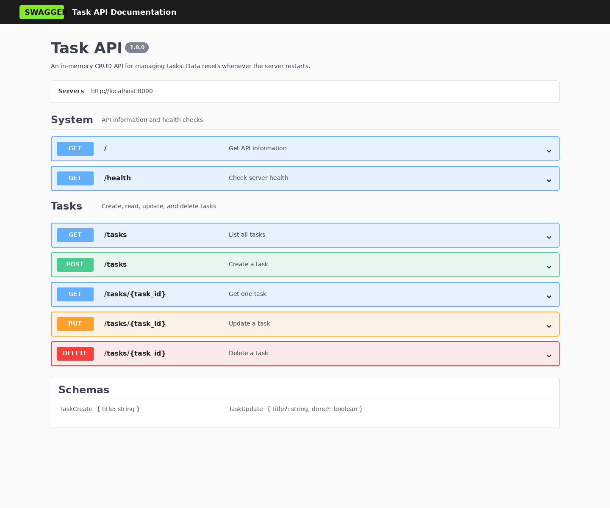

# FlyRank Task CRUD API

A small in-memory REST API built with **Python**, **FastAPI**, and **Swagger UI** for FlyRank's BE-01 assignment. It supports the full CRUD cycle for a to-do list and returns JSON responses with the required HTTP status codes.

## Features

- Create, read, update, and delete tasks
- Three seeded example tasks
- Input validation with JSON error messages
- Correct status codes: 200, 201, 204, 400, and 404
- Interactive Swagger UI at `/docs`
- In-memory storage, so changes reset when the server restarts

## Requirements

- Python 3.10 or newer
- pip

## Install and run

```bash
python3 -m venv .venv
source .venv/bin/activate
pip install -r requirements.txt
./run.sh
```

The server starts at <http://localhost:8000> and Swagger UI is available at <http://localhost:8000/docs>.

## Endpoints

| Method | Endpoint | Purpose | Success status |
|---|---|---|---:|
| GET | `/` | API name, version, and endpoint summary | 200 |
| GET | `/health` | Server health check | 200 |
| GET | `/tasks` | List all tasks | 200 |
| GET | `/tasks/{task_id}` | Get one task | 200 |
| POST | `/tasks` | Create a task | 201 |
| PUT | `/tasks/{task_id}` | Update a task's title and/or completion state | 200 |
| DELETE | `/tasks/{task_id}` | Delete a task | 204 |
| GET | `/docs` | Open Swagger UI | 200 |

Unknown task IDs return **404**. Invalid POST or PUT bodies return **400**, with an error object such as:

```json
{ "error": "Title is required and cannot be empty" }
```

## Example curl output

Command:

```bash
curl -i http://localhost:8000/tasks/1
```

Output:

```http
HTTP/1.1 200 OK
date: Mon, 27 Jul 2026 18:12:11 GMT
server: uvicorn
content-length: 51
content-type: application/json

{"id":1,"title":"Learn FastAPI basics","done":true}
```

## Test the full CRUD cycle

Start the API in one terminal, then run this in another:

```bash
./scripts/test_api.sh
```

The script verifies successful and unsuccessful reads, creation, validation, updating, deletion, and confirmation of deletion.

## Swagger UI

Open <http://localhost:8000/docs>, expand an endpoint, select **Try it out**, enter any required values, and select **Execute**.

To capture the live Swagger UI screenshot after the server is running:

```bash
./scripts/capture_swagger.sh
```



## In-memory behavior

Tasks are stored in the `tasks` list while the Python process is running. Any tasks created or changed through the API disappear after a restart because no database or file is used. This is expected for the assignment and demonstrates why persistent databases are needed.

## Project structure

```text
.
├── docs/
│   ├── swagger-preview.html
│   └── swagger-ui.png
├── scripts/
│   ├── capture_swagger.sh
│   └── test_api.sh
├── .gitignore
├── main.py
├── README.md
├── requirements.txt
└── run.sh
```

## Git stages

The repository history contains one meaningful commit for every required stage:

1. `Stage 0: hello server`
2. `Stage 1: root and health endpoints`
3. `Stage 2: read endpoints with 404`
4. `Stage 3: create with validation`
5. `Stage 4: full CRUD`
6. `Stage 5: Swagger UI`
7. `Stage 6: publish and docs`
