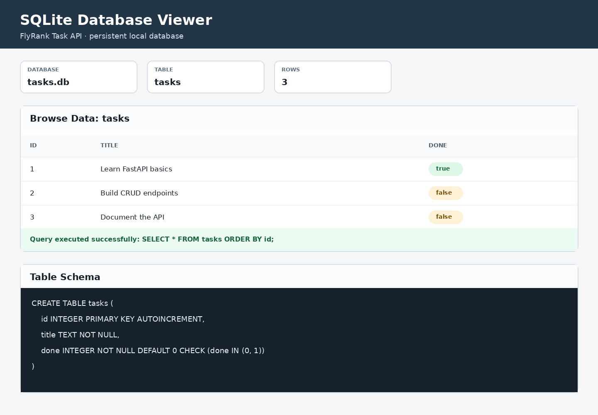

# FlyRank Task CRUD API — SQLite Edition

A persistent REST API built with **Python**, **FastAPI**, **SQLite**, and **Swagger UI** for FlyRank's BE-02 database assignment. It keeps the same CRUD endpoints from BE-01, but stores every task in a real SQL database instead of an in-memory list.

## What changed in BE-02

The API contract stayed the same:

```text
Client → FastAPI endpoints → SQLite database
```

Tasks now survive server restarts because they are stored in `tasks.db`. The application automatically creates the database, creates the `tasks` table, and inserts the three example tasks only when the table is empty.

## Why SQLite

SQLite was chosen because it:

- requires no separate database server or account;
- stores the complete database in one local file;
- supports standard SQL queries;
- is a practical choice for small applications and backend learning projects.

The runtime database file is stored at:

```text
./tasks.db
```

It is intentionally ignored by Git. Anyone cloning the repository gets a fresh database automatically the first time the application starts.

## Features

- Full create, read, update, and delete functionality
- Persistent SQLite storage
- Automatic table creation and one-time seeding
- Parameterized SQL queries
- Input validation with JSON error messages
- Correct status codes: `200`, `201`, `204`, `400`, and `404`
- Interactive Swagger UI at `/docs`
- Automated CRUD and persistence checks

## Requirements

- Python 3.10 or newer
- pip

## Install and run

```bash
python3 -m venv .venv
source .venv/bin/activate
python3 -m pip install -r requirements.txt
./run.sh
```

The API starts at <http://localhost:8000>.

Swagger UI is available at <http://localhost:8000/docs>.

## Endpoints

| Method | Endpoint | Purpose | Success status |
|---|---|---|---:|
| GET | `/` | API name, version, and endpoint summary | 200 |
| GET | `/health` | Server health check | 200 |
| GET | `/tasks` | List every task from SQLite | 200 |
| GET | `/tasks/{task_id}` | Get one task | 200 |
| POST | `/tasks` | Insert a task | 201 |
| PUT | `/tasks/{task_id}` | Update a task's title and/or completion state | 200 |
| DELETE | `/tasks/{task_id}` | Delete a task | 204 |
| GET | `/docs` | Open Swagger UI | 200 |

Unknown IDs return:

```json
{ "error": "Task not found" }
```

Invalid POST or PUT bodies return status `400` with a JSON error message.

## Database schema

The database is initialized with this table:

```sql
CREATE TABLE IF NOT EXISTS tasks (
    id INTEGER PRIMARY KEY AUTOINCREMENT,
    title TEXT NOT NULL,
    done INTEGER NOT NULL DEFAULT 0 CHECK (done IN (0, 1))
);
```

## Database viewer

The screenshot below was generated from the real `tasks.db` database and shows its rows and schema.



To regenerate the local viewer and screenshot:

```bash
./scripts/capture_database_viewer.sh
```

The script also creates `docs/database-viewer.html`, which can be opened directly in a browser.

## SQL exploration

The assignment's manual SQL queries are saved in [`sql/exploration.sql`](sql/exploration.sql).

Example query:

```sql
SELECT * FROM tasks WHERE done = 1;
```

Other queries exercised in Stage 4 include:

```sql
SELECT * FROM tasks;
SELECT COUNT(*) FROM tasks;
UPDATE tasks SET done = 1;
DELETE FROM tasks WHERE done = 1;
```

Run the exploration safely against a temporary copy of the database:

```bash
python3 scripts/run_sql_exploration.py
```

The captured output is available in [`docs/sql-exploration-output.txt`](docs/sql-exploration-output.txt).

## Test the CRUD API

Start the API in one terminal, then run this in another:

```bash
./scripts/test_api.sh
```

The script tests successful and unsuccessful reads, creation, validation, updating, deletion, and confirmation of deletion.

## Test persistence

Run:

```bash
python3 scripts/test_persistence.py
```

This creates a temporary SQLite database, inserts an additional task, reloads the application, and confirms that the task still exists and that the three seed tasks were not duplicated.

## Project structure

```text
.
├── database.py
├── main.py
├── tasks.db                       # generated locally; ignored by Git
├── docs/
│   ├── database-viewer.html
│   ├── database-viewer.png
│   ├── sql-exploration-output.txt
│   └── swagger-ui.png
├── scripts/
│   ├── capture_database_viewer.py
│   ├── capture_database_viewer.sh
│   ├── generate_database_viewer.py
│   ├── run_sql_exploration.py
│   ├── test_api.sh
│   └── test_persistence.py
├── sql/
│   └── exploration.sql
├── .gitignore
├── README.md
├── requirements.txt
└── run.sh
```

## Assignment commit history

The repository preserves the BE-01 history and adds one meaningful commit for each BE-02 stage:

1. `Stage 0: create SQLite database`
2. `Stage 1: database read endpoints`
3. `Stage 2: insert into database`
4. `Stage 3: update and delete with SQL`
5. `Stage 4: explored SQLite`
6. `Stage 5: database documentation`

## BE-04 Stage 0: standalone Postgres container

Before the Compose stack is introduced, Postgres can be started independently with:

```bash
POSTGRES_PASSWORD=dev ./scripts/postgres_container.sh start
```

The helper mounts the named Docker volume `taskdata`, so rows outlive the container.
